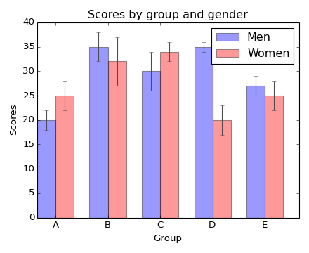
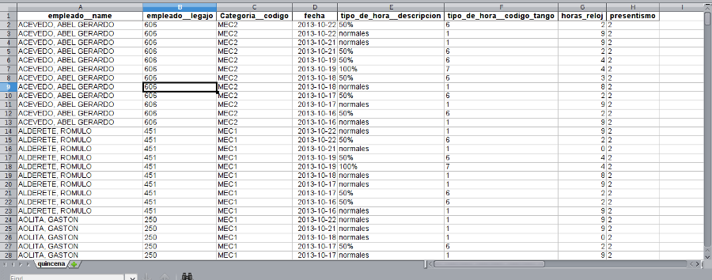
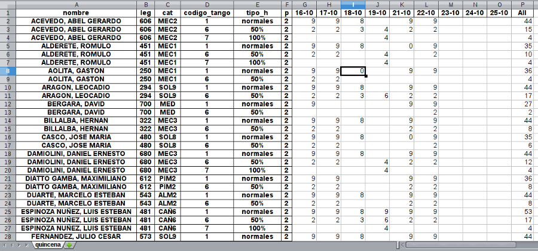
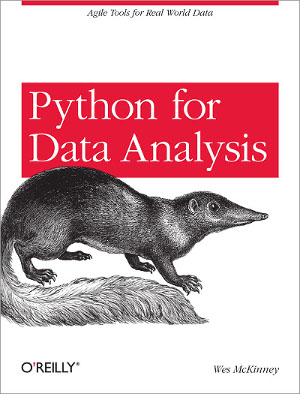

# Análisis de datos con Pandas

---

# Hola!

---

## Franco Mariluis

- Programador en MSA (http://www.msa.com.ar)
- Estudiante de Ciencia Política en la UBA
- @fmariluis
- www.github.com/fmariluis

---

## Colaborador: Beto

---

# Qué es Pandas?

Pandas (http://pandas.pydata.org/) es una librería que brinda
estructuras de datos especializadas para facilitar el análisis y la
transformación de información obtenida de diversas fuentes.

- Es rápido (mucho código escrito en Cython)
- Activamente desarrollado
- Utiliza y extiende numpy
- Production-ready: la librería **de facto** para el análisis de datos
  en Python

---

# Qué se puede hacer con Pandas?

- Fácil manejo de información faltante
- Es muy sencillo manipular la forma del set de datos (agregar o quitar
  columnas, "pivotear", o mezclar con otros set de datos)
- Muchas herramientas de IO: importa de y hacia una variedad de formatos
  (CSV, xls, HDF5, json, etc.)
- Funciona especialmente bien en combinación con Ipython / Matplotblib
  para su uso interactivo, pero también puede usarse fácilmente en un
script o en un framework web como Django o Flask
- Poderosas herramientas para aplicar estadística descriptiva o
  cualquier función matemática sobre un set de datos.

---
# DataFrame

>*Two-dimensional size-mutable, potentially heterogeneous tabular data
>structure with labeled axes (rows and columns). Arithmetic operations
>align on both row and column labels. Can be thought of as a dict-like
>container for Series objects. The primary pandas data
>structure.*

---

# Proyectos relacionados

---

# Numpy

Numpy (http://www.numpy.org/) es una de las librerías fundamentales para
la computación científica en Python. Implementa un objeto array
n-dimensional muy eficiente, además de interacciones con Fortran, C++, y
otras funcionalidades matemáticas avanzadas.

En suma, Numpy aporta un tipo de datos muy eficiente para almacenar y
manipular información numérica. Este tipo de datos es la base del
*DataFrame* de Pandas.

---

# R

R (http://www.r-project.org/) es un entorno (y un lenguaje de programación) orientado a la
computación estadística y a los gráficos. Es un proyecto GNU y es
ampliamente usado para el análisis de datos.

Uno de los tipos de datos implementados por Pandas está inspirado en el
dataframe de R.

---
# Matplotlib

La librería de Python más popular para producir gráficos y
visualizaciones en 3D. Vamos a ver ejemplos de uso en la siguiente
sección.

---
# Instalación

    pip install numpy
    pip install pandas

---

---
# Ejemplo

Vamos a usar un csv con resultados de la elección presidencial del 2007 tomado del Portal Nacional de Datos Públicos: (http://datospublicos.gob.ar)

[Ver en un IPython Notebook](http://127.0.0.1:8888/ae8cd589-9ce2-4bf4-9b63-ea3ebef3678c)

---
# Uso interactivo

    ipython notebook --pylab inline

---
# Interacción con Django: caso de estudio

---
# Una aplicación web para la liquidación de horas del personal de la construcción

---
# Las horas se importan y liquidan en Tango Gestión, se requería la exportación desde Django en un formato específico

---
# AKA: generar una pivot table

---
# Generación de una tabla dinámica usando Pandas

---
# Tabla "normal"

---
# Tabla dinámica (pivot table)

---
# views.py
    !python
    @login_required
    @never_cache
    def reporte_quincena_liquidar(request, *args):
        """
        Reporte utilizado para la liquidación directa de la quincena
        """
        quincena = Hora.objects.select_related().filter(
            fecha__year=args[0],
            fecha__month=args[1], empleado__Grupo='UOCRA',
            quincena=args[2]).order_by('empleado', '-fecha')

        q = quincena.values(
            'empleado__name', 'empleado__legajo',
            'Categoria__codigo', 'fecha', 'tipo_de_hora__descripcion',
            'tipo_de_hora__codigo_tango', 'horas_reloj', 'presentismo')

        df_temp = pd.DataFrame.from_records(q, coerce_float=True)

        dd = lambda x: datetime.date.strftime(x, "%d-%m")

        df_temp.fecha = df_temp.fecha.map(dd)

        df = df_temp.rename(columns={
            'empleado__name': 'nombre', 'empleado__legajo': 'leg',
            'Categoria__codigo': 'cat', 'tipo_de_hora__descripcion': 'tipo_h',
            'tipo_de_hora__codigo_tango': 'codigo_tango', 'presentismo': 'p'})

        pv = pd.pivot_table(df, values="horas_reloj", cols="fecha", rows=[
            'nombre', 'leg', 'cat', 'codigo_tango', 'tipo_h',
            'p'], margins=True, aggfunc=sum)

        d_tag = '-' + args[0] + '-' + args[1] + '-' + args[2]

        filename = str('quincena' + d_tag + '.xls')

        pv.to_excel('/srv/www/hurondb.com.ar/public_html/static/reportes/' + filename,
                    sheet_name="quincena")

        return redirect('/static/reportes/' + filename)
---
# Vamos por partes

---
Armamos el queryset

    !python
        quincena = Hora.objects.select_related().filter(
            fecha__year=args[0],
            fecha__month=args[1], empleado__Grupo='UOCRA',
            quincena=args[2]).order_by('empleado', '-fecha')

Traemos el resultado en forma de dict

    !python
        q = quincena.values(
            'empleado__name', 'empleado__legajo',
            'Categoria__codigo', 'fecha', 'tipo_de_hora__descripcion',
            'tipo_de_hora__codigo_tango', 'horas_reloj', 'presentismo')

Creamos el dataframe a partir de ese dict

    !python
        df_temp = pd.DataFrame.from_records(q, coerce_float=True)

Creamos una función anónima para formatear la fecha

    !python
        dd = lambda x: datetime.date.strftime(x, "%d-%m")

Aplicamos la función anónima a la columna fecha para formatearla 

    !python
        df_temp.fecha = df_temp.fecha.map(dd)
---
Renombramos las columnas del dataframe

    !python
        df = df_temp.rename(columns={
            'empleado__name': 'nombre', 'empleado__legajo': 'leg',
            'Categoria__codigo': 'cat', 'tipo_de_hora__descripcion': 'tipo_h',
            'tipo_de_hora__codigo_tango': 'codigo_tango', 'presentismo': 'p'})

Generamos la pivot table

    !python
        pv = pd.pivot_table(df, values="horas_reloj", cols="fecha", rows=[
            'nombre', 'leg', 'cat', 'codigo_tango', 'tipo_h',
            'p'], margins=True, aggfunc=sum)

Creamos el xls

    !python
        pv.to_excel('/srv/www/hurondb.com.ar/public_html/static/reportes/' + filename,
                    sheet_name="quincena")
---
# Más información

---

---
# http://pandas.pydata.org/

---
# BTW

---
# Estamos buscando gente

---
# rrhh@msa.com.ar

---
# Gracias!
